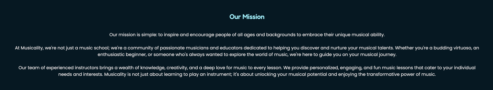

# Musicity

Musicity has been created and developed to inform users of the wide range of music lessons and programs on offer. The aim is to provide comprehensive information about the music lessons, instructors and the company's mission and goals.

Ultimately the goal is to promote the importance of musical education and encourage people of all ages and skill levels to explore, embrace and aim to improve their unique musical abilites

The site outlines the enrollment process and is makes it convinient for users to sign up for lessons. The site also entails clear calls-to-action and user-friendly navigation to guide users through the process

The live site can be accessed [here](https://lola-idowu.github.io/Musicity/)

## Features
---

### Existing Features

- **Navigation Bar**

  - The Navigation bar is featured on all pages of the site. It serves as a menu of links that allow users to navigate through the various pages of the website
  - The navigation bar adapts to different screen sixes. On smaller screens it collapses into a 'hamburger' menu, which expands when clicked, providing mobile users with a compact and user-friendly navigatio experience

- **Hero image**

  - The hero image, being the first visual element that the users see when they open the site, clearly conveys the site's theme, brand identity and the essence of it's content.
  - The image depicts hands playing a piano - clearly making the users aware that the theme of the content of the site will be surrounding music

- **Testimonial Section**

  - This section displays Musicity's testimonials - showcasing feedback and reviews from satisfied customers
  - This provides social proof to the users that the lessons offered are valuable and trustworthy

- **Contact Form**

  - The contact form allows a user-friendly way for users to reach out to express their interest in music lessons
  - The users are able to specify what musical inttrument they are interested in

- **The Footer**

  - The footer section includes a simple site map with links that navigate to the relevant page. The footer also consists of the site's contact details; number, address and email address.

  

- **Enrollment Process**

  - This section outlines the enrollment process, therefore users have a clear expectations of the process
  - It is a convenient section that can encourage user's to get in toush as they now know wht to expect

- **Musicity's Mission and Goals**

  - The mission statement communicates the company's core values and ethical principles. This can serve as a benchmark for measuring Musicity's impact and success in achieving its stated goals
  - The purpose of the mission statement is to attratc like-minded users that share simular values and gioals
  

## User Experience
----
### User Stories 
The purpose of the user stories is to allow for user focused design in order to ensure that the needs and goals of the users are being satisifed

**As a user visiting this site I want:**

- To explore available music lessons that align with my skill level and interests
- To learn about Musicity's music program, outlining lesson programs
- Find informatio about the instructors, including their qualifications and teaching styles
- To access Musicity's socisal media
- Easily navigate throught the site and find comprehensive information about Musicity's offerings
- To be able to request a trial lesson or consultation to assess Musicity's suitability
- To read success stories from previous students, in order to ensure that the provided services are of high quality

### Responsive Web Design
**The website is fully responsive, adhering to all screen sizes:**

- Mobile Sizes - 375px
- Tablet Sizes - 768px
- Desktop (larger screens) Sizes - 992px and up

  
## Design
----

### Wireframes
Mid-fidelty wireframes were created using [Figma](https://www.figma.com/)
The wireframes can be accessed [here](https://www.figma.com/file/wcPfEothtQly5j77u4nCQC/Project-1?type=design&node-id=0%3A1&mode=design&t=95CwBUDHNlTlA9SG-1)

### Imagery
Images were obtained from [Pexels](<https://www.pexels.com/>) and [iStock](https://www.istockphoto.com/)

### Typography
[Google Fonts](https://fonts.google.com/?preview.text=Musicity&preview.text_type=custom)

**Site Logo** - Josefin, sans-serif

**Subheadings** - Fredoka, sans-serif

**Body text** - Poppins, sans-serif

### Colour Pallete
I chose a minimal and modern color palette, primarily centered around shades of blue. This color scheme not only aligns seamlessly with the Musicity's aesthetic but also enhances the overall user experience by imparting a welcoming and contemporary feel.

## Technologies
---

### Languages 

- HTML5 - Used for the creation of the struture for the website content.

- CSS3 - Cascading Style Sheets language used to style the site pages.

## Testing
----

### Lighthouse
I employed the Lighthouse tool within Chrome's developer tools to evaluate various aspects of each page, including:

**Performance** - This assesses how efficiently the page loads and functions

**Accessibility** - An examination of the site's inclusivity and potential enhancements to improve accessibility for all users.

**Best Practices** - Evaluating the site's adherence to industry standards and recommended practices.

**SEO (Search Engine Optimization)** - Determining whether the site is optimized to achieve higher search engine result rankings.

### HTML Validator
  No errors were returned when passing through the official [W3C validator](https://validator.w3.org/nu/?doc=https%3A%2F%2Fcode-institute-org.github.io%2Flove-running-2.0%2Findex.html)
- CSS

### CSS Validator
No errors were found when passing through the official [(Jigsaw) validator](https://jigsaw.w3.org/css-validator/validator?uri=https%3A%2F%2Fvalidator.w3.org%2Fnu%2F%3Fdoc%3Dhttps%253A%252F%252Fcode-institute-org.github.io%252Flove-running-2.0%252Findex.html&profile=css3svg&usermedium=all&warning=1&vextwarning=&lang=en#css)

## Manual Testing
---

## Unfixed Bugs
---
No bugs left unfixed

## Deployment
---

This section should describe the process you went through to deploy the project to a hosting platform (e.g. GitHub)

- The site was deployed to GitHub pages. The steps to deploy are as follows:
  - In the GitHub repository, navigate to the Settings tab
  - From the source section drop-down menu, select the Master Branch
  - Once the master branch has been selected, the page will be automatically refreshed with a detailed ribbon display to indicate the successful deployment.

The live link can be found here - <https://code-institute-org.github.io/love-running-2.0/index.html>

## Credits
---

### Content

- The text for the Home page was taken from Wikipedia Article A
- Instructions on how to implement form validation on the Sign Up page was taken from [Specific YouTube Tutorial](https://www.youtube.com/)
- The icons in the footer and contact section were obtained from [Font Awesome](https://fontawesome.com/)